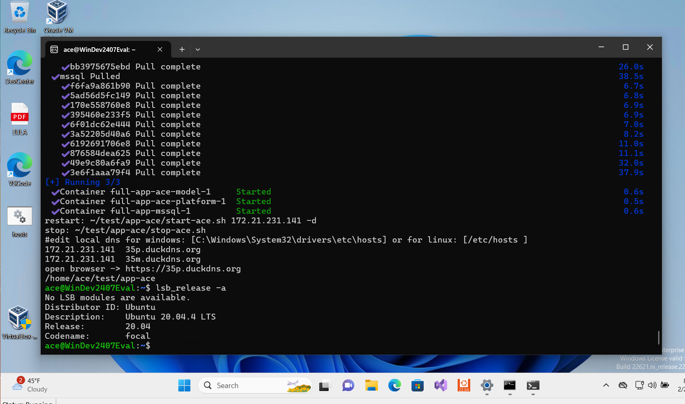

# DockerWorkshop prepare

-Enable wsl [install Linux on Windows with WSL]

-Setup Ubuntu on Windows 


# Setup Ubuntu 

-enable systemd

```
sudo nano /etc/wsl.conf
```

-/etc/wsl.conf

```
[boot] 
systemd=true
```

# Terminate and restart ubuntu

```
wsl -t Ubuntu
```

# Install Docker&Docker Compose

- Install/install.sh
**[install.sh](Install/install.sh)**

# Lookup IP address of linux[windows subsystem]
[eth1]
```
ip add
ip -4 -o addr show eth0 | awk '{print $4}'
```
[eno1]
```
ip add
ip -4 -o addr show eno1 | awk '{print $4}'
```

# Prepare docker login 

-Your GitHub username and Github Personal Access Token (PAT) with the read:packages permission. 
-Remember to configure SSO for the token by authorizing access to the Configit Products organization

```
docker login ghcr.io --username=[your-loginname] --password=[token]
```

# Options 
## Install Ace[7.1.0]

    mssql: ubuntu-latest
    ```
    bash <(curl -sSL "https://us.workplace.datto.com/filelink/6813-7ddfdd1e-89cefaaab0-2")

    ```

## Install Ace[0.0.0]

    mssql: 2022-latest

    ```
    bash <(curl -sSL "https://us.workplace.datto.com/filelink/6813-7e0b87f4-41607f59a7-2")

    ```

# Edit Windows local host file

- edit local dns for windows: [C:\Windows\System32\drivers\etc\hosts]
- As an example:
```
172.21.231.141  35p.duckdns.org
172.21.231.141  35m.duckdns.org
```
# open browser

-> https://35p.duckdns.org

# Stop and Start ace

```
~/test/app-ace/stop-ace.sh
```

```
~/test/app-ace/start-ace.sh
```


# Result


